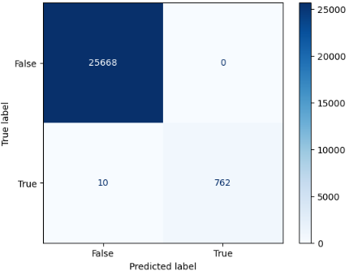

<h1 align="center">Identifying Fraudulent Transactions on the Blockchain</h1>

  

## Describe your project (big idea)
The big idea is to identify possible fraudulent transactions made on the bitcoin network. These transactions would be a result from Randsomware attacks and/or other fraudulent transactions such as known purchases on black market marketplaces. 

The idea is to create a model that monitors blockchain transaction data, block by block, and notifiy law enforcement if there are any possible transactions with known wallets that were previously used for transactions and to flag any other new addresses that associate with these wallet addresses. 

This will help break some of the anonminity associated with people who own the wallets and help law enforcement track down bad actors. 

## Describe your goal
The goal is to be able to classify transactions based on amount, and wallet addresses if it is possible that it was used for fraudulent activities. In order to do this a model would need to be built on previously recognized fraudulent data and to identify a pattern to these transactions and legitamite transaction data. 

## Describe your data
The data used is transactions history from 2016 - end of 2018. Also the fraudulent data set is the known fraudulent transactions from that time period and the price data. 

   
   
   

## Describe your work (models, analysis, EDA, etc.)
After attaining the datasets, since there are a large number of transactions they would need to be filtered. They were filtered to the beginning date range of the heist dataset. (March, 2016) and then further sampled down to 80k transactions. 

  
  

Most of the transactions were on the first day. This would be because of the primary elections in the states. Typically political events in the states affect investor sentiment and that would lead to an increase of transactions for that day. 

## Describe your results
The models used would be a classification model. However running a simple Logistic Regression model with the target variable being the flag column 'is_possible_fraud' resulted in a 99% accuracy. 

  

Ideally the model would need to classify if sender_address, destination_address, and amount of satoshi's could predict if this is possible fraud. So a multi-variable classification model would need to be researched to handle this or possibly running multiple logistic regression models on the different target variables. Further research would need to be conducted. 

## Party!
Yay, party !

   
  
  

